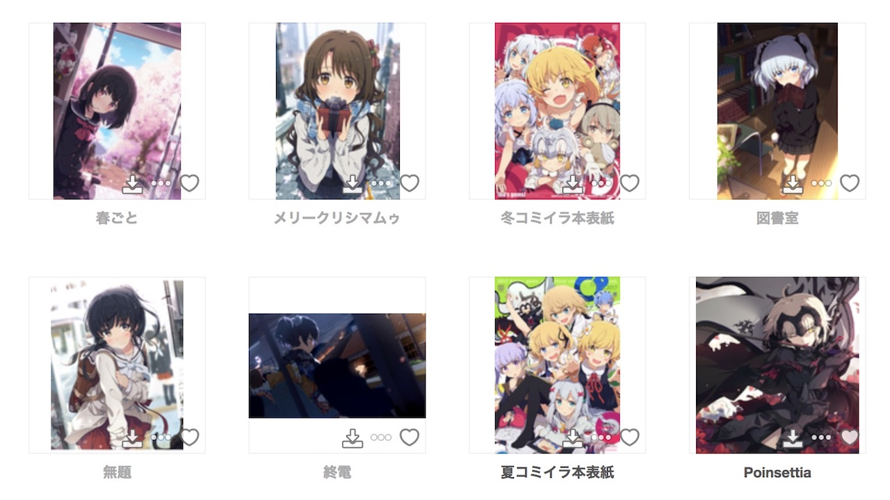
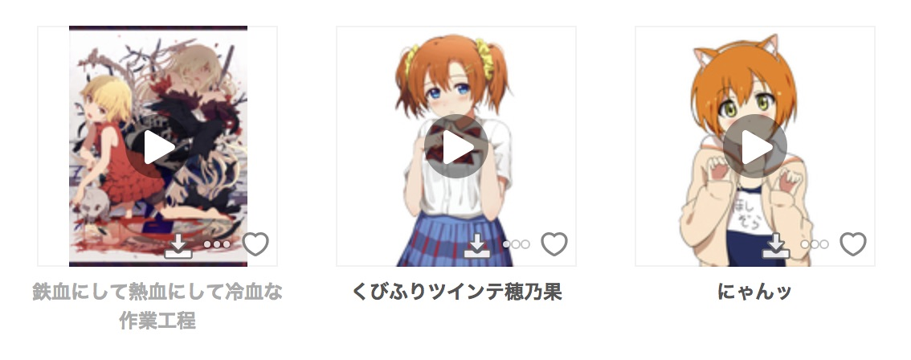
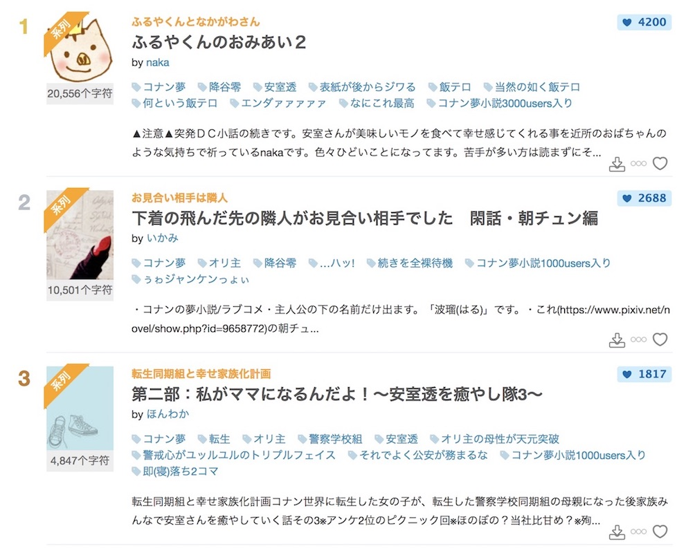

<h1 align="center">Pixiv One Click</h1>

[](https://travis-ci.org/HayashiMei/PixivOneClick)

## Introduction

只是一个简单的谷歌扩展，在部分页面的插画、漫画、小说的缩略图上增加了下载按钮，点击后直接下载原图、小说文本。

## Screenshot

以下截图截自[荻 pote](https://www.pixiv.net/member.php?id=2131660)和[小说每日排行榜](https://www.pixiv.net/novel/ranking.php?mode=daily)。

### Illust



### Manga/Multiple illust


### Ugoku illust



### Novel



## Build

```
$ npm install
$ npm run build
```

## Install

在 Chrome 的 **扩展程序页面(chrome://extensions)** 通过 **加载已解压的扩展程序** 安装这个扩展。

## Attention

只是在好奇心的驱使下做着玩的，参考了很多现有的 Pixiv 扩展，没啥用(・ω<) てへぺろ

test
