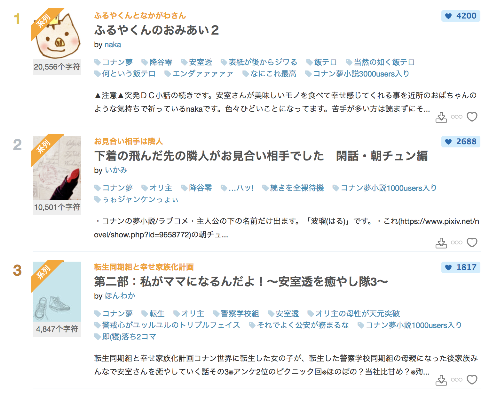
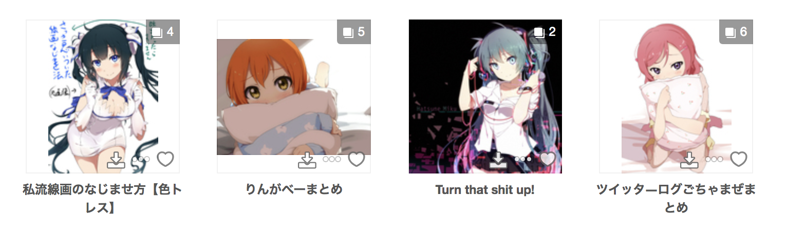

<h1 align="center">Pixiv One Click</h1>

## Introduction

只是一个简单的谷歌扩展，在部分页面的插画、漫画、小说的缩略图上增加了下载按钮，点击后直接下载原图、小说文本。

## Screenshot

### Illust


### Manga/Multiple illust



### Ugoku illust


### Novel



## Build

```
$ npm install
$ npm run build
```

## Install

在Chrome的 [扩展程序页面](chrome://extensions) 通过 **加载已解压的扩展程序** 安装这个扩展。